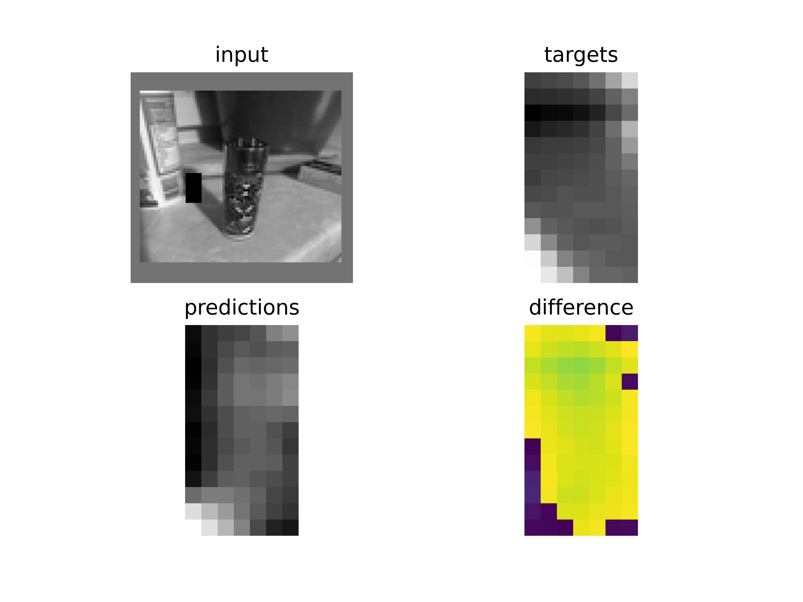

# Python II challenge
This project predicts missing parts in an image using a simple CNN.  
It is based on the sample project provided by `Michael Widrich`, but heavily modified.  
The input dataset was created from thousands of user images
submitted in the first exercise of the semester (not included),
but can create a new dataset from any kind of greyscale images.


### Usage
Simply call the main function with any configuration json file:
```
python3 main.py <config>.json
```

`debug_config.json` trains less, print more stats and plots more often.  
For the final predictions `working_config.json` was used.

### Structure
```
python2_challenge
|- architectures.py
|    Classes and functions for network architectures
|- datasets.py
|    Dataset classes and dataset helper functions
|- debug_config.json
|    A modified copy of the working_config with smaller parameter values for debugging
|- main.py
|    Main file
|    Also includes training and evaluation routines
|- README.md
|    This description
|- utils.py
|    Utility functions and classes
|    In this case contains a plotting function and a de-normalization function
|- working_config.json
|    The configuration file used to train the model and make final predictions
```

### Visualization example
After about 5000 training iterations (with batch-size 16) the plotted output
might look something like this:

